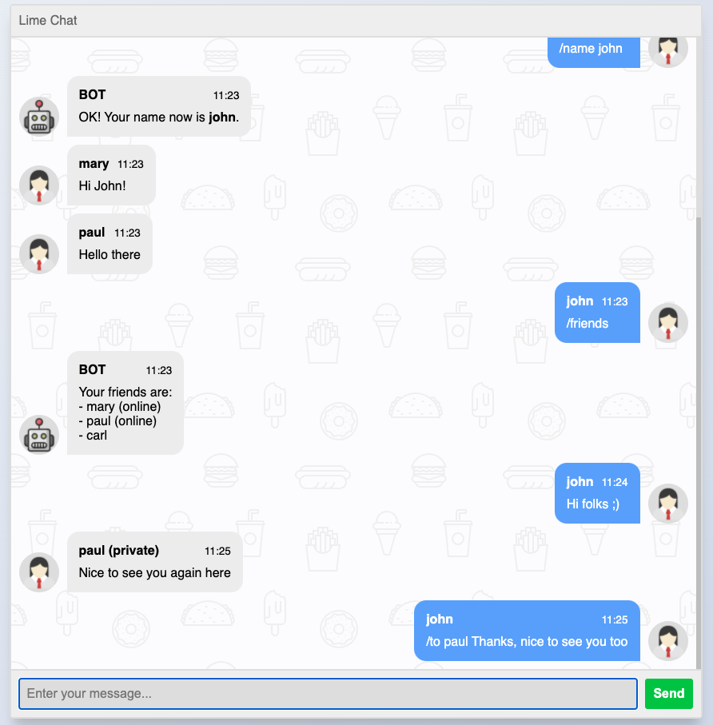

# Websocket chat

A simple chat room made with Lime.



## Requirements

- [Go 1.17+](https://go.dev/doc/install)
- [NPM 8.1+](https://docs.npmjs.com/getting-started/configuring-your-local-environment)

## Starting the server

Go to the `server` directory and run from the source using the command:
```bash
$ go run .
```
It will start listening for websocket connections in the 8080 port.

## Building the client
In the `client` directory, run the following command:
```bash
$ npm install
$ npm run build
```

This will compile the Javascript bundle to the `client/dist` folder.
Then go to the `client/dist` directory and open the `index.html` in your browser.
Every open instance of this page will connect as a distinct client to the server.

## References

- Chat HTML and CSS template: https://codepen.io/sajadhsm/pen/odaBdd
- Icons: https://loading.io/icon

